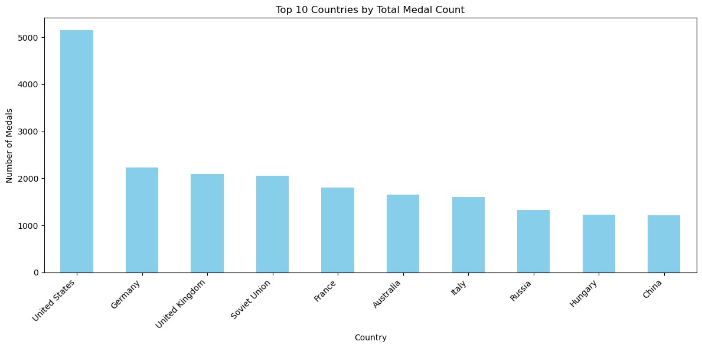
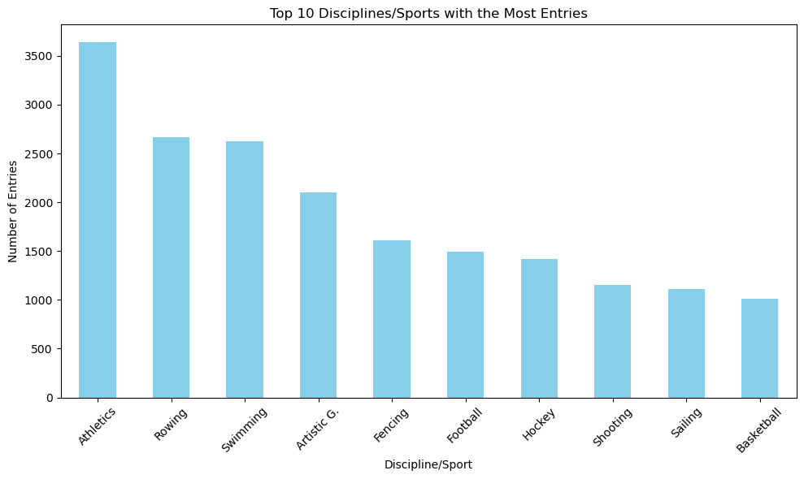
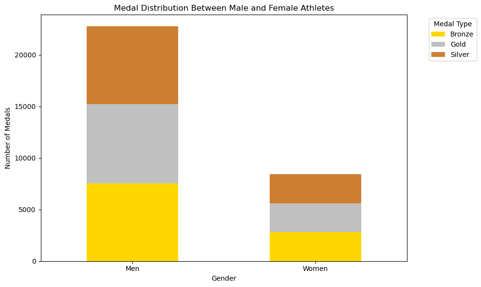
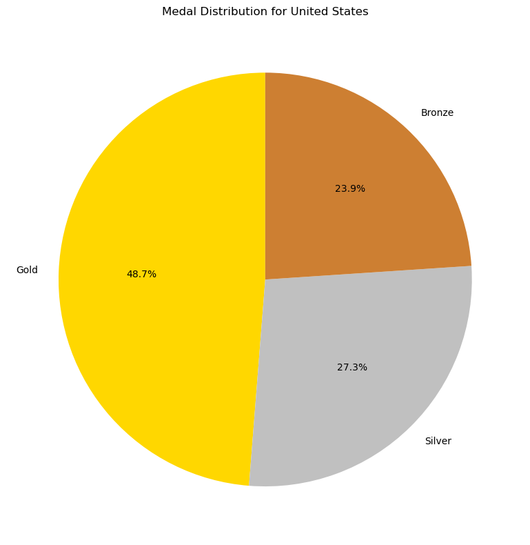
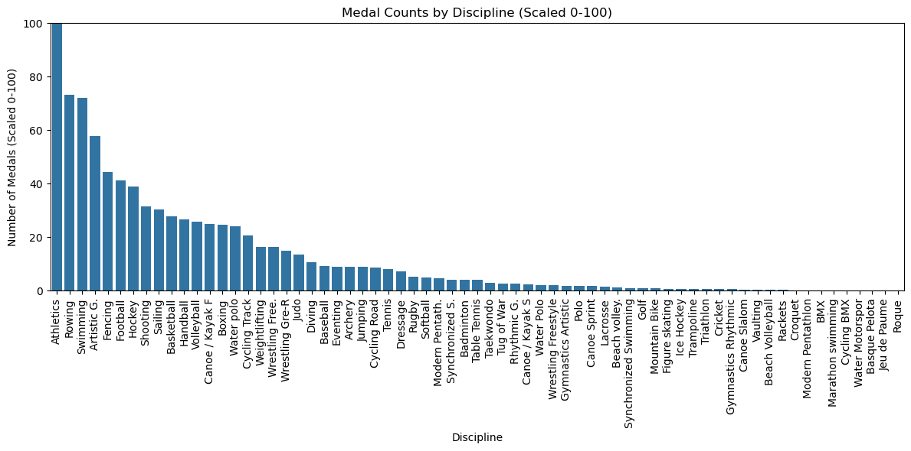
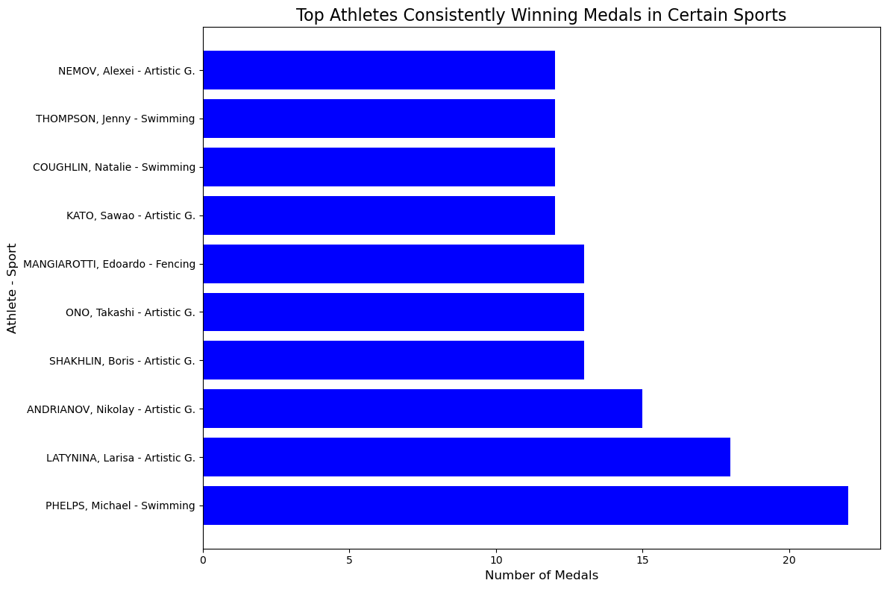
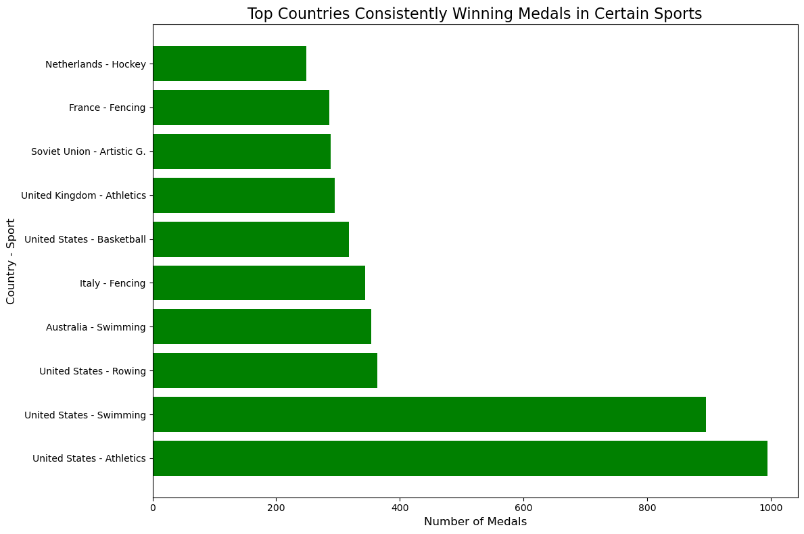
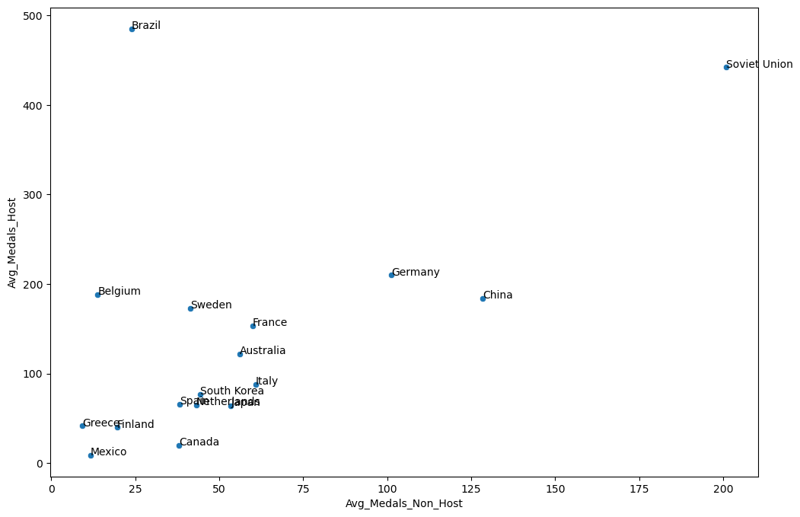
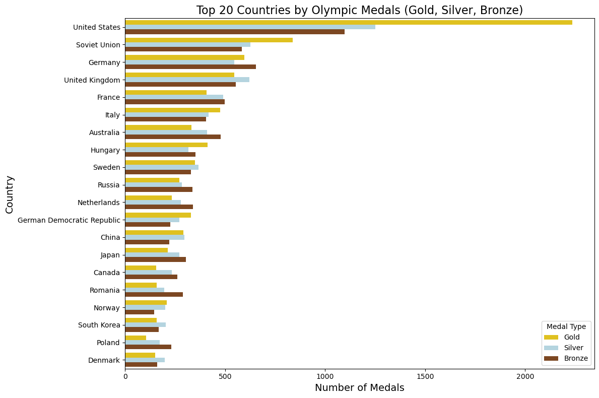

```python
import pandas as pd

# Load the CSV file into a DataFrame
file_path ="C:\\Users\\agaje\\Desktop\\EDA\\concatenated_df.csv" # Path to your uploaded file
df = pd.read_csv(file_path)

# Display the first 5 rows of the DataFrame
df.head()
```


<div>
<style scoped>
    .dataframe tbody tr th:only-of-type {
        vertical-align: middle;
    }

    .dataframe tbody tr th {
        vertical-align: top;
    }

    .dataframe thead th {
        text-align: right;
    }
</style>
<table border="1" class="dataframe">
  <thead>
    <tr style="text-align: right;">
      <th></th>
      <th>Year</th>
      <th>City</th>
      <th>Sport</th>
      <th>Discipline</th>
      <th>Athlete</th>
      <th>Country</th>
      <th>Gender</th>
      <th>Event</th>
      <th>Medal</th>
      <th>Hosted</th>
    </tr>
  </thead>
  <tbody>
    <tr>
      <th>0</th>
      <td>1896</td>
      <td>Athens</td>
      <td>Aquatics</td>
      <td>Swimming</td>
      <td>HAJOS, Alfred</td>
      <td>Hungary</td>
      <td>Men</td>
      <td>100M Freestyle</td>
      <td>Gold</td>
      <td>False</td>
    </tr>
    <tr>
      <th>1</th>
      <td>1896</td>
      <td>Athens</td>
      <td>Aquatics</td>
      <td>Swimming</td>
      <td>HERSCHMANN, Otto</td>
      <td>Austria</td>
      <td>Men</td>
      <td>100M Freestyle</td>
      <td>Silver</td>
      <td>False</td>
    </tr>
    <tr>
      <th>2</th>
      <td>1896</td>
      <td>Athens</td>
      <td>Aquatics</td>
      <td>Swimming</td>
      <td>DRIVAS, Dimitrios</td>
      <td>Greece</td>
      <td>Men</td>
      <td>100M Freestyle For Sailors</td>
      <td>Bronze</td>
      <td>True</td>
    </tr>
    <tr>
      <th>3</th>
      <td>1896</td>
      <td>Athens</td>
      <td>Aquatics</td>
      <td>Swimming</td>
      <td>MALOKINIS, Ioannis</td>
      <td>Greece</td>
      <td>Men</td>
      <td>100M Freestyle For Sailors</td>
      <td>Gold</td>
      <td>True</td>
    </tr>
    <tr>
      <th>4</th>
      <td>1896</td>
      <td>Athens</td>
      <td>Aquatics</td>
      <td>Swimming</td>
      <td>CHASAPIS, Spiridon</td>
      <td>Greece</td>
      <td>Men</td>
      <td>100M Freestyle For Sailors</td>
      <td>Silver</td>
      <td>True</td>
    </tr>
  </tbody>
</table>
</div>


```python
import pandas as pd
import matplotlib.pyplot as plt
import seaborn as sns

medal_counts = df['Country'].value_counts().head(10)

# Create a bar plot
plt.figure(figsize=(12, 6))
medal_counts.plot(kind='bar', color='skyblue')
plt.title('Top 10 Countries by Total Medal Count')
plt.xlabel('Country')
plt.ylabel('Number of Medals')
plt.xticks(rotation=45, ha='right')
plt.tight_layout()
plt.show()

print(medal_counts)
```


    

    


    Country
    United States     5152
    Germany           2236
    United Kingdom    2094
    Soviet Union      2049
    France            1806
    Australia         1649
    Italy             1608
    Russia            1323
    Hungary           1233
    China             1211
    Name: count, dtype: int64
    


```python
import pandas as pd
import matplotlib.pyplot as plt


# Step 1: Group by discipline/sport and count the entries
discipline_counts = df.groupby('Discipline').size().sort_values(ascending=False)

# Step 2: Plot the top 10 disciplines/sports with the most entries
top_disciplines = discipline_counts.head(10)

# Plotting
plt.figure(figsize=(10, 6))
top_disciplines.plot(kind='bar', color='skyblue')
plt.title('Top 10 Disciplines/Sports with the Most Entries')
plt.ylabel('Number of Entries')
plt.xlabel('Discipline/Sport')
plt.xticks(rotation=45)
plt.tight_layout()
plt.show()

# Display the top 10 disciplines with the most entries
print("Top 10 disciplines/sports with the most entries:")
print(top_disciplines)
```


    

    


    Top 10 disciplines/sports with the most entries:
    Discipline
    Athletics      3638
    Rowing         2667
    Swimming       2628
    Artistic G.    2103
    Fencing        1613
    Football       1497
    Hockey         1422
    Shooting       1150
    Sailing        1109
    Basketball     1012
    dtype: int64
    


```python
medal_gender_distribution = pd.crosstab(df['Gender'], df['Medal'])

# Step 2: Plot the distribution of medals between male and female athletes
medal_gender_distribution.plot(kind='bar', stacked=True, figsize=(10, 6), color=['#FFD700', '#C0C0C0', '#CD7F32'])

# Customize the plot
plt.title('Medal Distribution Between Male and Female Athletes')
plt.xlabel('Gender')
plt.ylabel('Number of Medals')
plt.xticks(rotation=0)
plt.legend(title='Medal Type', bbox_to_anchor=(1.05, 1), loc='upper left')
plt.tight_layout()
plt.show()

# Display the contingency table for detailed numbers
print("Medal distribution between male and female athletes:")
print(medal_gender_distribution)
```


    

    


    Medal distribution between male and female athletes:
    Medal   Bronze  Gold  Silver
    Gender                      
    Men       7539  7698    7509
    Women     2830  2788    2801
    


```python
country_medal_counts = df.groupby('Country')['Medal'].count().reset_index()

# Find the top-performing country
top_country = country_medal_counts.loc[country_medal_counts['Medal'].idxmax()]

# Filter the data for the top-performing country
top_country_data = df[df['Country'] == top_country['Country']]

# Count the distribution of medals for the top country
top_country_medal_distribution = top_country_data['Medal'].value_counts()

# Create a pie chart for the medal distribution
plt.figure(figsize=(8, 8))
top_country_medal_distribution.plot(kind='pie', autopct='%1.1f%%', startangle=90, colors=['gold', 'silver', '#cd7f32'])
plt.title(f"Medal Distribution for {top_country['Country']}")
plt.ylabel('')
plt.tight_layout()
plt.show()

print(f"Top-performing athlete: {top_country['Country']}")
print(top_country_medal_distribution)
```


    

    


    Top-performing athlete: United States
    Medal
    Gold      2235
    Silver    1252
    Bronze    1098
    Name: count, dtype: int64
    


```python
# Step 1: Calculate overall standard deviation of medal counts across disciplines
discipline_std = df.groupby('Discipline')['Medal'].count().std()
print(f"Overall standard deviation of medal counts across disciplines: {discipline_std:.2f}")

# Step 2: Calculate medal counts for each discipline
discipline_counts = df['Discipline'].value_counts()

# Step 3: Normalize the medal counts to a scale of 0-100
scaled_discipline_counts = (discipline_counts / discipline_counts.max()) * 100

# Step 4: Create a bar plot for the normalized medal counts by discipline
plt.figure(figsize=(12, 6))
sns.barplot(x=scaled_discipline_counts.index, y=scaled_discipline_counts.values)
plt.title('Medal Counts by Discipline (Scaled 0-100)')
plt.xlabel('Discipline')
plt.ylabel('Number of Medals (Scaled 0-100)')
plt.xticks(rotation=90)
plt.ylim(0, 100)  # Ensure y-axis is scaled from 0 to 100
plt.tight_layout()
plt.show()

# Step 5: Display top 5 and bottom 5 disciplines by medal count (non-scaled)
print("\nTop 5 disciplines by medal count (actual values):")
print(discipline_counts.head())

print("\nBottom 5 disciplines by medal count (actual values):")
print(discipline_counts.tail())
```

    Overall standard deviation of medal counts across disciplines: 725.49
    


    

    


    
    Top 5 disciplines by medal count (actual values):
    Discipline
    Athletics      3638
    Rowing         2667
    Swimming       2628
    Artistic G.    2103
    Fencing        1613
    Name: count, dtype: int64
    
    Bottom 5 disciplines by medal count (actual values):
    Discipline
    Cycling BMX        6
    Water Motorspor    5
    Basque Pelota      4
    Jeu de Paume       3
    Roque              3
    Name: count, dtype: int64
    


```python
# Drop rows with missing athlete, discipline, or medal type information
df_cleaned_athletes = df.dropna(subset=['Athlete', 'Discipline', 'Medal'])

# Group by athlete and sport (discipline), and count the number of medals won in each sport
athlete_sport_medals = df_cleaned_athletes.groupby(['Athlete', 'Discipline']).size().reset_index(name='Medal Count')

# Sort by athlete and medal count to find athletes that consistently win medals in the same sport
consistent_athletes = athlete_sport_medals[athlete_sport_medals['Medal Count'] > 1].sort_values(by='Medal Count', ascending=False)

# Display the top athletes that consistently win medals in certain sports
print(consistent_athletes)

```

                         Athlete   Discipline  Medal Count
    15872        PHELPS, Michael     Swimming           22
    11334       LATYNINA, Larisa  Artistic G.           18
    514       ANDRIANOV, Nikolay  Artistic G.           15
    18305        SHAKHLIN, Boris  Artistic G.           13
    15049           ONO, Takashi  Artistic G.           13
    ...                      ...          ...          ...
    12277     LUNG, Noemi Ildiko     Swimming            2
    12298            LUSIC, Deni   Water polo            2
    4262      DE LA FUENTE, Juan      Sailing            2
    12300        LUSK, Stanislav       Rowing            2
    1      AALTONEN, Arvo Ossian     Swimming            2
    
    [5141 rows x 3 columns]
    


```python
# Plot the consistent athletes that win medals in certain sports
plt.figure(figsize=(12, 8))
consistent_athletes_top = consistent_athletes.head(10)  # Top 10 athletes

plt.barh(consistent_athletes_top['Athlete'] + ' - ' + consistent_athletes_top['Discipline'],
         consistent_athletes_top['Medal Count'], color='blue')

plt.title('Top Athletes Consistently Winning Medals in Certain Sports', fontsize=16)
plt.xlabel('Number of Medals', fontsize=12)
plt.ylabel('Athlete - Sport', fontsize=12)
plt.tight_layout()
plt.show()
```


    

    


```python
import pandas as pd

# Corrected file path (replace with your actual file path)
file_path = "C:\\Users\\agaje\\Desktop\\EDA\\concatenated_df.csv"

# Load the CSV file into a DataFrame
df = pd.read_csv(file_path)

# Drop rows with missing country, discipline, or medal type information
df_cleaned = df.dropna(subset=['Country', 'Discipline', 'Medal'])

# Group by country and sport (discipline), and count the number of medals won in each sport
country_sport_medals = df_cleaned.groupby(['Country', 'Discipline']).size().reset_index(name='Medal Count')

# Sort by country and medal count to find countries that consistently win medals in the same sport
consistent_countries = country_sport_medals[country_sport_medals['Medal Count'] > 1].sort_values(by='Medal Count', ascending=False)

# Display the top countries that consistently win medals in certain sports
print(consistent_countries)
```

                Country       Discipline  Medal Count
    1228  United States        Athletics          994
    1263  United States         Swimming          895
    1258  United States           Rowing          364
    57        Australia         Swimming          354
    632           Italy          Fencing          344
    ...             ...              ...          ...
    600           India  Wrestling Free.            2
    595           India           Boxing            2
    593           India        Athletics            2
    590         Iceland        Athletics            2
    0               AFG        Taekwondo            2
    
    [1084 rows x 3 columns]
    


```python
# Plot the consistent countries that win medals in certain sports
import matplotlib.pyplot as plt

# Plot for countries
plt.figure(figsize=(12, 8))
consistent_countries_top = consistent_countries.head(10)  # Top 10 countries

plt.barh(consistent_countries_top['Country'] + ' - ' + consistent_countries_top['Discipline'],
         consistent_countries_top['Medal Count'], color='green')

plt.title('Top Countries Consistently Winning Medals in Certain Sports', fontsize=16)
plt.xlabel('Number of Medals', fontsize=12)
plt.ylabel('Country - Sport', fontsize=12)
plt.tight_layout()
plt.show()

```


    

    


```python
# Group the data by event and country, then count the number of occurrences
event_country_counts = df.groupby(['Event', 'Country']).size().reset_index(name='count')

# Group the data by event and gender, then count the number of occurrences
event_gender_counts = df.groupby(['Event', 'Gender']).size().reset_index(name='count')

# Find the top 3 countries for each event
top_countries_per_event = event_country_counts.groupby('Event')['count'].nlargest(3)

# Find the top 3 genders for each event
top_genders_per_event = event_gender_counts.groupby('Event')['count'].nlargest(3)

# Print the results
print("Top 3 countries per event:")
print(top_countries_per_event)
print("\nTop 3 genders per event:")
print(top_genders_per_event)
```

    Top 3 countries per event:
    Event                           
    + 100KG                     0        1
                                1        1
                                2        1
    + 100KG (Heavyweight)       7        3
                                9        3
                                        ..
    Épée Team                   7197    75
                                7196    30
    Épée, Amateurs And Masters  7208     2
                                7207     1
    Épée, Masters               7209     3
    Name: count, Length: 1872, dtype: int64
    
    Top 3 genders per event:
    Event                                  
    + 100KG                             0        4
    + 100KG (Heavyweight)               1       16
    + 100KG (Super Heavyweight)         2       24
    + 105KG                             3        9
    + 108KG, Total (Super Heavyweight)  4        3
                                              ... 
    Épée Individual                     847     15
    Épée Team                           848    343
                                        849     42
    Épée, Amateurs And Masters          850      3
    Épée, Masters                       851      3
    Name: count, Length: 852, dtype: int64
    


```python
import pandas as pd
import matplotlib.pyplot as plt

# Assuming medal_data is already loaded and cleaned as in your previous code
# If not, uncomment and modify the following lines:
#medal_data = pd.read_csv("C:\\Users\\agaje\\Desktop\\EDA\\concatenated_df.csv")
medal_data = medal_data.dropna(subset=['Sport', 'Discipline', 'Gender'])

# Group by Sport, Discipline, and Gender to count medals
sport_gender_counts = medal.groupby(['Sport', 'Discipline', 'Gender']).size().unstack(fill_value=0)

# Rename columns for clarity
sport_gender_counts.columns = ['Female', 'Male']

# Calculate total medals and gender ratios
sport_gender_counts['Total'] = sport_gender_counts['Female'] + sport_gender_counts['Male']
sport_gender_counts['Female_Ratio'] = sport_gender_counts['Female'] / sport_gender_counts['Total']
sport_gender_counts['Male_Ratio'] = sport_gender_counts['Male'] / sport_gender_counts['Total']

# Sort by total medals
sport_gender_counts_sorted = sport_gender_counts.sort_values('Total', ascending=False)

# Function to determine dominance
def get_dominance(row):
    if row['Female_Ratio'] > 0.6:
        return 'Female Dominated'
    elif row['Male_Ratio'] > 0.6:
        return 'Male Dominated'
    else:
        return 'Balanced'

sport_gender_counts_sorted['Dominance'] = sport_gender_counts_sorted.apply(get_dominance, axis=1)

# Display top 20 sports/disciplines by total medals
print(sport_gender_counts_sorted.head(20))

# Visualization
plt.figure(figsize=(15, 10))
top_n = 20  # Top N sports/disciplines to display

# Create stacked bar chart
sport_gender_counts_sorted.head(top_n).plot(kind='bar', stacked=True, y=['Female', 'Male'])

plt.title(f'Gender Distribution in Top {top_n} Olympic Sports/Disciplines')
plt.xlabel('Sport/Discipline')
plt.ylabel('Number of Medals')
plt.legend(title='Gender')
plt.xticks(rotation=45, ha='right')
plt.tight_layout()
plt.show()

# Print summary of gender dominance
dominance_summary = sport_gender_counts_sorted['Dominance'].value_counts()
print("\nSummary of Gender Dominance in Sports/Disciplines:")
print(dominance_summary)

# List top 5 male-dominated and female-dominated sports
print("\nTop 5 Male-Dominated Sports/Disciplines:")
print(sport_gender_counts_sorted[sport_gender_counts_sorted['Dominance'] == 'Male Dominated'].head())

print("\nTop 5 Female-Dominated Sports/Disciplines:")
print(sport_gender_counts_sorted[sport_gender_counts_sorted['Dominance'] == 'Female Dominated'].head())
```


    ---------------------------------------------------------------------------

    NameError                                 Traceback (most recent call last)

    Cell In[68], line 10
          7 medal_data = medal_data.dropna(subset=['Sport', 'Discipline', 'Gender'])
          9 # Group by Sport, Discipline, and Gender to count medals
    ---> 10 sport_gender_counts = medal.groupby(['Sport', 'Discipline', 'Gender']).size().unstack(fill_value=0)
         12 # Rename columns for clarity
         13 sport_gender_counts.columns = ['Female', 'Male']
    

    NameError: name 'medal' is not defined


```python
import pandas as pd
import matplotlib.pyplot as plt
import seaborn as sns

# Assuming medal_data is already loaded and cleaned as in your previous code
# If not, uncomment and modify the following line:
medal_data = pd.read_csv("C:\\Users\\agaje\\Desktop\\EDA\\concatenated_df.csv")

# Create a dictionary of host countries and years
host_countries = {
    1896: 'Greece', 1900: 'France', 1904: 'USA', 1908: 'UK', 1912: 'Sweden',
    1920: 'Belgium', 1924: 'France', 1928: 'Netherlands', 1932: 'USA', 1936: 'Germany',
    1948: 'UK', 1952: 'Finland', 1956: 'Australia', 1960: 'Italy', 1964: 'Japan',
    1968: 'Mexico', 1972: 'West Germany', 1976: 'Canada', 1980: 'Soviet Union',
    1984: 'USA', 1988: 'South Korea', 1992: 'Spain', 1996: 'USA', 2000: 'Australia',
    2004: 'Greece', 2008: 'China', 2012: 'UK', 2016: 'Brazil', 2020: 'Japan'
}

# Function to check if a country was the host in a given year
def is_host(row):
    return host_countries.get(row['Year']) == row['Country']

# Add a column to indicate if the country was the host
medal_data['Is_Host'] = medal_data.apply(is_host, axis=1)

# Group by Country, Year, and Is_Host to count medals
medal_counts = medal_data.groupby(['Country', 'Year', 'Is_Host']).size().reset_index(name='Medal_Count')

# Calculate average medals for each country when hosting and not hosting
host_performance = medal_counts.groupby(['Country', 'Is_Host'])['Medal_Count'].mean().unstack()
host_performance.columns = ['Avg_Medals_Non_Host', 'Avg_Medals_Host']
host_performance = host_performance.dropna()  # Remove countries that never hosted

# Calculate the difference in performance
host_performance['Difference'] = host_performance['Avg_Medals_Host'] - host_performance['Avg_Medals_Non_Host']
host_performance = host_performance.sort_values('Difference', ascending=False)

# Print the results
print(host_performance)

# Visualization


# Statistical test
from scipy import stats

host_medals = host_performance['Avg_Medals_Host']
non_host_medals = host_performance['Avg_Medals_Non_Host']

t_statistic, p_value = stats.ttest_rel(host_medals, non_host_medals)

print(f"\nt-statistic: {t_statistic}")
print(f"p-value: {p_value}")

if p_value < 0.05:
    print("There is statistically significant evidence of a home advantage.")
else:
    print("There is no statistically significant evidence of a home advantage.")
```

                  Avg_Medals_Non_Host  Avg_Medals_Host  Difference
    Country                                                       
    Brazil                  23.944444            485.0  461.055556
    Soviet Union           200.875000            442.0  241.125000
    Belgium                 13.791667            188.0  174.208333
    Sweden                  41.400000            173.0  131.600000
    Germany                101.300000            210.0  108.700000
    France                  59.960000            153.5   93.540000
    Australia               56.200000            122.0   65.800000
    China                  128.375000            184.0   55.625000
    South Korea             44.333333             77.0   32.666667
    Greece                   9.294118             41.5   32.205882
    Spain                   38.277778             66.0   27.722222
    Italy                   60.800000             88.0   27.200000
    Netherlands             43.125000             65.0   21.875000
    Finland                 19.583333             40.0   20.416667
    Japan                   53.500000             64.0   10.500000
    Mexico                  11.736842              9.0   -2.736842
    Canada                  38.000000             20.0  -18.000000
    
    t-statistic: 3.0555039539145503
    p-value: 0.0075513527381638485
    There is statistically significant evidence of a home advantage.
    


```python
plt.figure(figsize=(12, 8))
sns.scatterplot(data=host_performance.reset_index(), x='Avg_Medals_Non_Host', y='Avg_Medals_Host')

# Add labels for each point
for idx, row in host_performance.iterrows():
    plt.annotate(idx, (row['Avg_Medals_Non_Host'], row['Avg_Medals_Host']))

# Add a diagonal line for reference


#max_val = max(host_performance['Avg_Medals_Non_Host'].max(), host_performance['Avg_Medals_Host'].max())
plt.plot([0, max_val], [0, max_val], 'r--')

plt.title('Average Medal Count: Host vs Non-Host Years')
plt.xlabel('Average Medals in Non-Host Years')
plt.ylabel('Average Medals in Host Years')
plt.tight_layout()
plt.show()
```


    ---------------------------------------------------------------------------

    NameError                                 Traceback (most recent call last)

    Cell In[3], line 12
          6     plt.annotate(idx, (row['Avg_Medals_Non_Host'], row['Avg_Medals_Host']))
          8 # Add a diagonal line for reference
          9 
         10 
         11 #max_val = max(host_performance['Avg_Medals_Non_Host'].max(), host_performance['Avg_Medals_Host'].max())
    ---> 12 plt.plot([0, max_val], [0, max_val], 'r--')
         14 plt.title('Average Medal Count: Host vs Non-Host Years')
         15 plt.xlabel('Average Medals in Non-Host Years')
    

    NameError: name 'max_val' is not defined


    

    


```python
import pandas as pd

# Load the dataset
df = pd.read_csv("C:\\Users\\agaje\\Desktop\\EDA\\concatenated_df.csv")

# Filter out rows where the medal is NaN (no medal awarded)
medals_df = df[df['Medal'].notna()]

# Count the medals by country
medal_counts = medals_df.groupby(['Country', 'Medal']).size().unstack(fill_value=0)

# Rename the columns for better readability
medal_counts.columns = ['Bronze', 'Gold', 'Silver']

# Display the result
print(medal_counts)
```

                Bronze  Gold  Silver
    Country                         
    AFG              2     0       0
    AHO              0     0       1
    ARM              8     1       2
    AZE             15     6       5
    Algeria          8     5       2
    ...            ...   ...     ...
    VEN              8     2       2
    Vietnam          0     0       2
    Yugoslavia     118   143     174
    Zambia           1     0       1
    Zimbabwe         1    18       4
    
    [140 rows x 3 columns]
    


```python
import pandas as pd

# Load the dataset
df = pd.read_csv("C:\\Users\\agaje\\Desktop\\EDA\\concatenated_df.csv")

# Filter out rows where the medal is NaN (no medal awarded)
medals_df = df[df['Medal'].notna()]

# Count the medals by country
medal_counts = medals_df.groupby(['Country', 'Medal']).size().unstack(fill_value=0)

# Rename the columns for better readability
medal_counts.columns = ['Bronze', 'Gold', 'Silver']

# Calculate total medals for each country
medal_counts['Total'] = medal_counts.sum(axis=1)

# Sort the countries by total medals and get the top 20
top_20_countries = medal_counts.sort_values(by='Total', ascending=False).head(20)

# Display the result
print(top_20_countries)
```

                                Bronze  Gold  Silver  Total
    Country                                                
    United States                 1098  2235    1252   4585
    Soviet Union                   584   838     627   2049
    Germany                        655   595     545   1795
    United Kingdom                 553   546     621   1720
    France                         497   408     491   1396
    Italy                          404   476     416   1296
    Australia                      477   332     409   1218
    Hungary                        351   412     316   1079
    Sweden                         328   349     367   1044
    Russia                         337   270     284    891
    Netherlands                    339   233     279    851
    German Democratic Republic     225   329     271    825
    China                          221   290     296    807
    Japan                          303   213     272    788
    Canada                         262   155     232    649
    Romania                        288   157     195    640
    Norway                         145   209     200    554
    South Korea                    167   158     204    529
    Poland                         231   106     174    511
    Denmark                        160   150     197    507
    


```python


# Reset index for plotting
top_20_countries.reset_index(inplace=True)

# Set the figure size
plt.figure(figsize=(12, 8))

# Melt the DataFrame for better plotting
top_20_melted = top_20_countries.melt(id_vars='Country', value_vars=['Gold', 'Silver', 'Bronze'], 
                                        var_name='Medal Type', value_name='Count')

# Create a bar plot
sns.barplot(data=top_20_melted, x='Count', y='Country', hue='Medal Type', palette='viridis')

# Add titles and labels
plt.title('Top 20 Countries by Olympic Medals (Gold, Silver, Bronze)', fontsize=16)
plt.xlabel('Number of Medals', fontsize=14)
plt.ylabel('Country', fontsize=14)
plt.legend(title='Medal Type')

# Show the plot
plt.tight_layout()
plt.show()
```


    

    


```python

# Reset index for plotting
top_20_countries.reset_index(inplace=True)

# Set the figure size
plt.figure(figsize=(12, 8))

# Melt the DataFrame for better plotting
top_20_melted = top_20_countries.melt(id_vars='Country', value_vars=['Gold', 'Silver', 'Bronze'], 
                                        var_name='Medal Type', value_name='Count')

# Create a bar plot with specific colors for each medal type
sns.barplot(data=top_20_melted, x='Count', y='Country', hue='Medal Type',
            hue_order=['Gold', 'Silver', 'Bronze'],
            palette={'Gold': '#FFD700', 'Silver': '#ADD8E6', 'Bronze': '#8B4513'})

# Add titles and labels
plt.title('Top 20 Countries by Olympic Medals (Gold, Silver, Bronze)', fontsize=16)
plt.xlabel('Number of Medals', fontsize=14)
plt.ylabel('Country', fontsize=14)
plt.legend(title='Medal Type')

# Show the plot
plt.tight_layout()
plt.show()
```


    

    


```python

```
